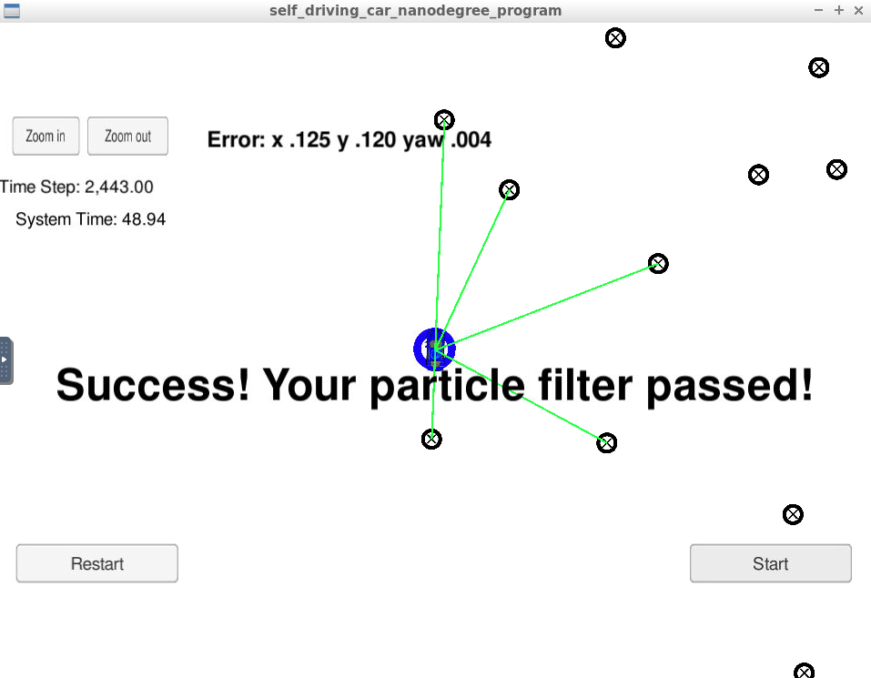

## Project Introduction
Your robot has been kidnapped and transported to a new location! Luckily it has a map of this location, a (noisy) GPS estimate of its initial location, and lots of (noisy) sensor and control data.

This project includes a 2 dimensional particle filter in C++.  The particle filter flowchart looks something like this:

The particle filter gets initialized with GPS coordinates to conduct sampling in a relatively small area.  Each sample is a particle, randomly placed based on a normal distribution with mean equal to the GPS position.

The prediction step takes each particle generated, and predicts each particle's future state based on vehicle's yaw rate and velocity.

The update weight step matches the landmark positions from each particle with known landmark positions with nearest neighbor method.  The x and y distances between matching landmarks are used in multi-variate Gaussian distribution to update weights (probability).

The resampleing step regenerates a new set of particles based on the updated weights.

The process iterates over and over and converge to the ground-truth location of the vehicle, with certain error.

## Running the Code
This project involves the Term 2 Simulator which can be downloaded [here](https://github.com/udacity/self-driving-car-sim/releases)

This repository includes two files that can be used to set up and install uWebSocketIO for either Linux or Mac systems. For windows you can use either Docker, VMware, or even Windows 10 Bash on Ubuntu to install uWebSocketIO.

The main program is already built, so only the following command is required:

./particle_filter

## Results
### Accuracy
Several trials of varying sampling were conducted.

| Samples |  x err |  y err | yaw err|  time  |
| ------- | ------ | ------ | ------ | ------ |
|   10    |  0.149 |  0.123 |  0.005 |  49.90 |
|   30    |  0.125 |  0.120 |  0.004 |  48.94 |
|  100    |  0.114 |  0.107 |  0.004 |  50.72 |
|  500    |  0.109 |  0.101 |  0.004 |  64.86 |
| 1000    |  0.107 |  0.101 |  0.004 |  94.10 |

Below is the snapshot of one of the results.

The highest accuracy occurs when the sampling is the highest (1000), which makes perfect sense; however, the improvement over 500 samples is very minor.

### Performance
From the table above, the time to finish the test stays pretty constant at low sampling rates until 500 samples were used.  At samples of 1000, the time is very close to max allowed of 100.

### Overall
Combining both accuracy and performance, either 30 or 100 provides quite satisfying results.  The accuracy is quite high while the response is very fast.
